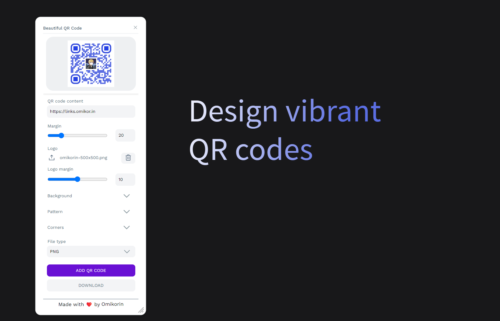

# 🎨 Penpot Beautiful QR Code

Transform ordinary QR codes into vibrant design elements directly within Penpot! This plugin allow designers to create custom, visually appealing QR codes.



## ✨ Why Beautiful QR Code?

- **Rich Customization**: Create unique QR codes with gradients, patterns, custom colors, and logos
- **Accessible**: Built with accessibility in mind
- **Instant Preview**: See your changes in real-time with always on top preview
- **Multiple Export Options**: Save your QR codes in PNG, SVG, WEBP, or JPEG format

## 🎯 Key Features

### Customization Options
- Add your brand logo to the center
- Adjust margin (safe zone) for optimal scanning
- Choose from 6 unique pattern styles
- Select from 5 distinct corner styles

### Rich Styling
- Single color or gradient backgrounds
- Linear and radial gradient support
- Full color customization
- Pattern and corner styling options

## 🚀 Getting Started

1. Visit the [Penpot Plugins Hub](https://penpot.app/penpothub/plugins/beautiful-qr-code)
2. Click the "Install" button for Beautiful QR Code
3. Alternative installation: Use this manifest link in Penpot's plugin installer:
   ```
   https://penpot-beautiful-qrcode.pages.dev/manifest.json
   ```

## 💻 Development

Want to contribute or run locally? Here's how:

```bash
# Install dependencies
bun install

# Start development server with live preview
bun run dev

# Build for production
bun run build
```

Next, install the plugin using this link:
```
http://localhost:4400/manifest.local.json
```

## 🤝 Contributing

Contributions are welcome! Feel free to submit issues and pull requests.

## 🙏 Acknowledgments

Thanks to Feather Icons for their beautiful open source icons.

## 📄 License

This project is licensed under the [AGPL 3.0 license](./LICENSE).

### Trademark

The word "QR Code" is a registered trademark of [DENSO WAVE INCORPORATED](http://www.denso-wave.com/en/).

---

<p align="center">Made with ❤️ by Michał Korczak</p>

---
