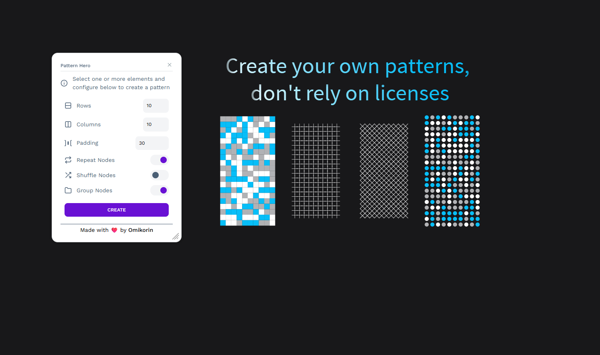

# 🎯 Pattern Hero

Create stunning, repeatable patterns for your designs directly within Penpot! This plugin helps designers generate beautiful, customizable patterns from any shape or component.



## ✨ Why Pattern Hero?

- **Simple & Powerful**: Create complex patterns with just a few clicks
- **Highly Customizable**: Adjust rows, columns, padding, and more
- **Component Support**: Works seamlessly with Penpot components

## 🎯 Key Features

- Adjustable rows and columns
- Custom padding between elements
- Optional element repetition
- Random shuffle capability

## 🚀 Getting Started

1. Visit the [Penpot Plugins Hub](https://penpot.app/penpothub/plugins)
2. Click the "Install" button for Pattern Hero
3. Alternative installation: Use this manifest link in Penpot's plugin installer:
   ```
   https://penpot-pattern-hero.pages.dev/manifest.json
   ```

## 💻 Development

Want to contribute or run locally? Here's how:

```bash
# Install dependencies
bun install

# Start development server with live preview
bun run dev

# Build for production
bun run build
```

Next, install the plugin using this link:
```
http://localhost:4400/manifest.local.json
```

## 🤝 Contributing

Contributions are welcome! Feel free to submit issues and pull requests.

## 🙏 Acknowledgments

- Special thanks to [Pattern Hero for Figma](https://www.figma.com/community/plugin/740556241021336678/pattern-hero) for the inspiration and original concept. This Penpot plugin aims to bring similar functionality to the Penpot community while maintaining its own identity.
- Thanks to Feather Icons for their beautiful open source icons.

## 📄 License

This project is licensed under the [AGPL 3.0 license](./LICENSE).

---

<p align="center">Made with ❤️ by Michał Korczak</p>

---
